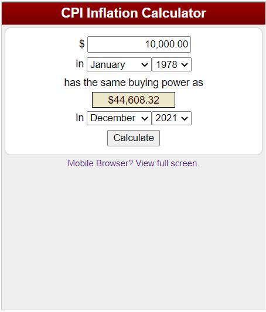
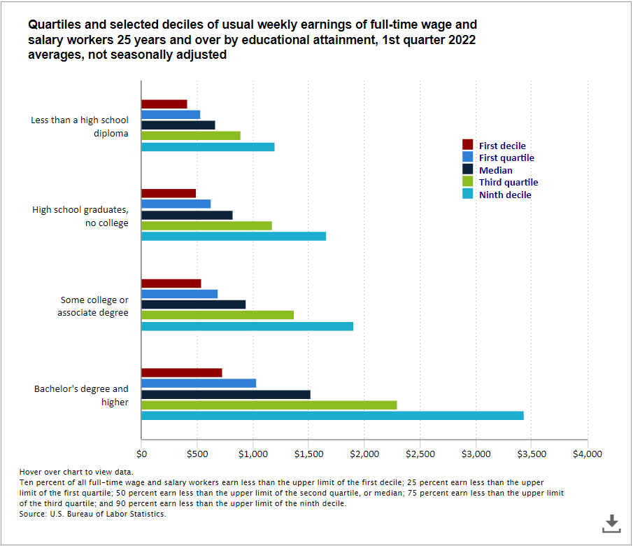
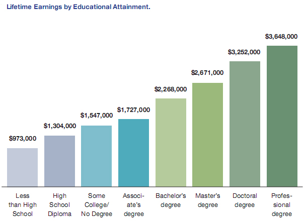
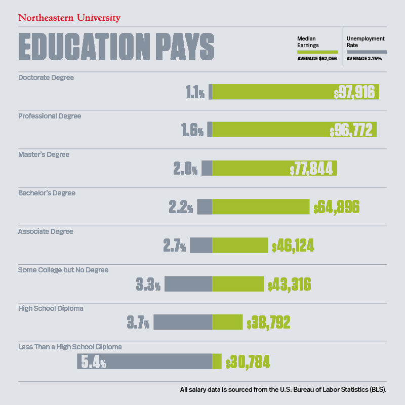

```{r setup, include=FALSE}
knitr::opts_chunk$set(echo = TRUE)
```

## **Motivation**

During my last semester of undergrad at UT Austin, I took a class on the Economics of Education which discussed the value of a college degree. It has been empirically proven that more years of education leads to higher wages and lifetime earnings. I would like to use R to present a visualization of the value of a college degree. This interactive data visualization will be using data from the US Bureau of Labor Statistics.

## **Comparing Increases in Tuition to the Rate of Inflation**

According to the US Bureau of Labor Statistics, the CPI is a measure of the average change over time in the prices paid by urban consumers for a market basket of consumer goods and services. College tuition and fixed fees, a component of the tuition, other school fees, and childcare index, is included in the education and communication major group of the Consumer Price Index (CPI). Not all goods in the CPI increase in line with the rate of inflation, as seen in the following visualization:

```{r, echo=FALSE, message=FALSE}

library(plotly)
library(tidyverse)
library(readr)
library(tidyquant)

#Importing the CSV file into a data frame
Tuition_1978_2021 <- read_csv("Tuition_1978_2021.csv")
data <- as.data.frame(Tuition_1978_2021)

#Creating a graph of the data with year on the x-axis and dollars on the y-axis
fig <- plot_ly(data, x = ~Year, y = ~Jan, name = "Jan", type = 'scatter', mode = 'lines+markers')%>%
  add_trace(x = ~Year, y = ~Feb, name = 'Feb', mode = 'lines+markers')%>%
  add_trace(x = ~Year, y = ~Mar, name = 'Mar', mode = 'lines+markers')%>%
  add_trace(x = ~Year, y = ~Apr, name = 'Apr', mode = 'lines+markers')%>%
  add_trace(x = ~Year, y = ~May, name = 'May', mode = 'lines+markers')%>%
  add_trace(x = ~Year, y = ~Jun, name = 'Jun', mode = 'lines+markers')%>%
  add_trace(x = ~Year, y = ~Jul, name = 'Jul', mode = 'lines+markers')%>%
  add_trace(x = ~Year, y = ~Aug, name = 'Aug', mode = 'lines+markers')%>%
  add_trace(x = ~Year, y = ~Sep, name = 'Sep', mode = 'lines+markers')%>%
  add_trace(x = ~Year, y = ~Oct, name = 'Oct', mode = 'lines+markers')%>%
  add_trace(x = ~Year, y = ~Nov, name = 'Nov', mode = 'lines+markers')%>%
  add_trace(x = ~Year, y = ~Dec, name = 'Dec', mode = 'lines+markers')%>%
  add_trace(x = ~Year, y = ~Inflation, name = 'Inflation', mode = 'lines+markers')%>%
  
  layout(title = 'Increases in College Tuition Between Jan 1978 and Dec 2021',
         legend = list(title = list(text='Month')),
         xaxis = list(title = "Year"),
         yaxis = list(title = "Monthly Tuition Cost in USD"))

options(warn = -1)

fig <- fig %>%
  layout(
    xaxis = list(zerolinecolor = '#ffff',
                 zerolinewidth = 2,
                 gridcolor = 'ffff'),
    yaxis = list(zerolinecolor = '#ffff',
                 zerolinewidth = 2,
                 gridcolor = 'ffff'),
    plot_bgcolor='#B7F7FC')

fig
```

### **Analysis of Inflation Data**

  + According to the BLS CPI Inflation Calculator: <https://www.bls.gov/data/inflation_calculator.htm>
  
  + **$10,000 in January 1978** has the same buying power as **$44,608.32 in December 2021**
    + The cumulative price increase is **346.08%**
  + Meanwhile, college tuition used to cost around **$58.30 per month in January 1978** and costs around **$896.184 per month in December 2021**
    + The cumulative price increase is **1437.19%**
  + Increases in college tuition have outpaced the rate of inflation **by more than a factor of 4 (4.15x)**

## **Comparing Average Weekly Earnings to the Level of Educational Attainment**

With the rising costs of obtaining a college degree in the US, some individuals may find it difficult to justify attending a 4-year university to obtain a bachelor's degree and may decide to either not attend college altogether or to obtain a cheaper 2-year associate's degree. In addition, financial hardships may lead to some individuals not being able to finish their 4-year bachelor's degree. However, as seen in the following visualization, data from the US Bureau of Labor Statistics shows that the median weekly wages of full-time and salary workers aged 25 and over differ significantly by their level of educational attainment:

```{r, echo=FALSE, message=FALSE}

library(plotly)
library(tidyverse)
library(readr)
library(tidyquant)

#Importing the CSV file into a data frame
Weekly_Earnings_Education <- read_csv("Weekly_Earnings_Education.csv")
data <- as.data.frame(Weekly_Earnings_Education)

#Creating a graph of the data with year on the x-axis and dollars on the y-axis
fig2 <- plot_ly(data, x = ~Year, y = ~Less_than_a_high_school_diploma, name = "Less_than_a_high_school_diploma", type = 'scatter', mode = 'lines+markers')%>%
  add_trace(x = ~Year, y = ~High_school_graduate_no_college, name = 'High_school_graduate_no_college', mode = 'lines+markers')%>%
  add_trace(x = ~Year, y = ~Some_college_or_associate_degree, name = 'Some_college_or_associate_degree', mode = 'lines+markers')%>%
  add_trace(x = ~Year, y = ~Bachelor_degree_and_higher, name = 'Bachelor_degree_and_higher', mode = 'lines+markers')%>%
  
  layout(title = 'Average Weekly Earnings by Educational Attainment Between 2000 and 2022',
         legend = list(title = list(text='Level of Education')),
         xaxis = list(title = "Year"),
         yaxis = list(title = "Average Weekly Earnings in USD"))

options(warn = -1)

fig2 <- fig2 %>%
  layout(
    xaxis = list(zerolinecolor = '#ffff',
                 zerolinewidth = 2,
                 gridcolor = 'ffff'),
    yaxis = list(zerolinecolor = '#ffff',
                 zerolinewidth = 2,
                 gridcolor = 'ffff'),
    plot_bgcolor='#B7F7FC')

fig2
```

### **Analysis of Earnings Data**

  + In 2022, individuals with a bachelor's degree or higher earned **$1,525** a week, compared to **$938** for those with some college or an associate's degree, **$827** for those with a high school degree and no college and **$670** for those with less than a high school degree.
    + Individuals with a bachelor's degree earn significantly more per week compared to those without a bachelor's degree.
  + In addition, while the increases in weekly earnings have been relatively constant for the other three levels of educational attainment, individuals with a bachelor's degree or higher have seen significant increases in their weekly earnings starting from **2015 to present.**

## **Additional Data Visualizations for Analysis**

### **Earnings by Educational Attainment in Q1 2022 for Bottom 10%, Bottom 25%, Median, Top 25%, and Top 10%**

{width=650}

Source: <https://www.bls.gov/charts/usual-weekly-earnings/usual-weekly-earnings-by-quartiles-and-selected-deciles-by-education.htm>

+ The earnings potential of having a bachelor's degree or higher is significantly greater than those who have less than a bachelor's degree.

### **Lifetime Earnings by Educational Attainment**

{width=650}

Source: <https://news.wsu.edu/news/2011/08/05/how-do-education-and-occupations-affect-lifetime-earnings/>

+ A bachelor's degree at a public state university costs around $10,000 in tuition per year over 4 years, and assuming that room and board is also around $10,000 a year, obtaining a bachelor's degree costs an individual **around $80,000 over 4 years.** If you decide to attend a private university, the tuition costs around $35,000 per year over 4 years which increases the total cost of a bachelor's degree to **$180,000 over 4 years.** This number is assuming the student has no scholarships or financial aid, which would reduce their out-of-pocket cost of attending university. As indicated by the graph, a bachelor's degree holder makes **around $500,000 higher lifetime earnings** than an associate's degree holder, **around $750,000 higher lifetime earnings** than someone with some college and no degree and **around $1,000,000 higher lifetime earnings** than someone with only a high school diploma. 

+ If you decide to attend additional years of school after you obtain your bachelor's degree, your lifetime earnings increase even further, by **around $400,000 higher lifetime earnings** for those with a master's degree, **around $1,000,000 higher lifetime earnings** for those with a doctorate's degree and **around $1,400,000 higher lifetime earnings** for those with a professional degree (such as an MD or DO). Master's degrees take around 1-2 years to complete and doctorate's and professional degrees take around 4-6 years to complete. 

### **Median Annual Earnings and Unemployment Rate by Educational Attainment**

{width=650}

Source: <https://www.northeastern.edu/bachelors-completion/news/average-salary-by-education-level/>

+ There is an **inverse relationship** between the years of education and unemployment rate. As you obtain higher levels of educational attainment, you have a decreasing chance of being unemployed at any given time.

## **Conclusion**

### **From a Cost-Benefit Analysis Standpoint**

+ From a cost-benefit analysis standpoint, by obtaining a bachelor's degree you have the potential to earn **$1,000,000 more** than if you only had a high school diploma over a lifetime of working. This is especially a good deal if you have the opportunity to attend college at a discounted cost, such as with scholarships, financial aid or a full ride.

+ By obtaining a master's degree (like those of us in the UTSA Masters of Statistics and Data Science program), you have the potential to earn **$400,000 more** than your peers with only a bachelor's degree.

+ There are some additional considerations to make, such as how you may go into debt in the short term to obtain your degree, and how long it will take to pay off your student loan debt.

  + One example is a student attending medical school to become a physician. Medical school costs around **$50,000 in tuition per year over four years,** which is followed by 4-7 years of residency where residents only make around **$60,000 per year.** Follow that by 1-3 years of fellowship, and it make take until you are in your early to mid 30s before you become a board-certified physician and start earning **over $100,000 annually.**

  + Compare that to a computer science bachelor's degree holder who started working in software engineering right after undergrad, or a finance bachelor's degree holder who started working in investment banking right after undergrad. In your early to mid 20s, it is more than possible to have a starting salary **over $100,000 annually** working in these careers. 
  
  + **The lifetime earning potential for some careers are higher than others even within the same level of educational attainment**, making certain bachelor's degree majors more competitive to get into (for example: engineering, computer science and business honors at UT Austin).

+ Ultimately, the decision of how much education an individual should attain is **dependent on their personal career goals and trajectories.** There is no right or wrong amount of educational attainment, but empirical data does show that higher levels of educational attainment will lead to higher wages and lifetime earnings.

## **Limitations and Further Studies**

+ I was unable to find data sets on the levels of education above a bachelor's degree on the US Bureau of Labor Statistics website, as their data grouped all levels of education that were higher than a bachelor's degree together into one category. In addition, the US Bureau of Labor Statistics also grouped all tuition for college into one category, rather than splitting tuition into associate's, bachelor's, master's, doctorate's and professional.

+ To further expand on this study, data could be collected on the average weekly earnings of those with a master's degree, doctorate's degree and professional degree. In addition, data could be collected on the cost of tuition for associate's, bachelor's, master's, doctorate's and professional degrees to analyze if there are any differences in tuition increases between these five levels of educational attainment. 